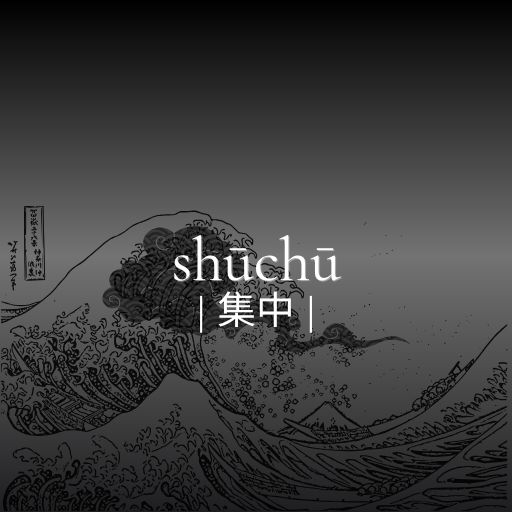

<p align="center">
  
</p>

# Shūchū (集中)

Shūchū is a minimalist browser extension built on the Manifest V3 architecture designed to eliminate digital friction on YouTube. By automating workspace isolation, the tool prevents algorithmic distraction patterns, establishes strict time-boxed focus parameters, and silences concurrent background media elements with a single interaction.

## Core Capabilities

* **Aggressive DOM De-cluttering:** Dynamically suppresses the primary YouTube homepage feed, related sidebar recommendation engines, user comments, and end-screen suggestion matrices via runtime CSS injections.
* **Granular Session Architecture:** Provides fixed time-boxed parameters (5, 10, and 15-minute operational windows) alongside validation-guarded custom inputs to eliminate configuration friction.
* **Concurrent Audio Interruption:** Evaluates the active state of all inactive browser contexts and applies conditional media element execution controls to immediately pause background video and audio tracks upon activation.
* **State Management Lifecycle:** Synchronizes live runtime state parameters across distinct popup UI viewports and the system service worker via programmatic messaging hooks to preserve continuous session integrity.

## Technical Architecture

The architecture relies strictly on modern decoupled browser environment interfaces:
* **Manifest V3 Core Framework:** Leverages isolated background service workers to sustain timer calculations and global runtime configurations without continuous window presence.
* **Content Injection Layer:** Utilizes specialized Web Component targeting scripts to securely isolate and neutralize structural recommendation nodes across shifting single-page application changes.
* **Native System Typography Stack:** Leverages system-level editorial typeface rendering structures directly to maintain high visual alignment metrics without incurring latency from remote network asset calls.

## Local Deployment Instructions

1. Clone the distribution repository onto your local system:
   ```bash
   git clone [https://github.com/dev-aj-5/shuchu.git](https://github.com/dev-aj-5/shuchu.git)
2. Open your target Chromium-based browser (Brave or Chrome) and navigate to the Extensions management terminal:
    ```bash
    chrome://extensions/  (or brave://extensions/)
3. Enable the Developer mode parameter located at the upper-right corner of the management window.
4. Select the Load unpacked module situated at the top-left toolbar workspace.
5. Identify and select the root directory container holding these structural repository files.
6. Launch a YouTube context window, interact with the Shūchū control dashboard, and select your desired session depth parameters to begin.
